# 1. Problema e dataset

**Contexto (Cenário A).** Uma central de distribuição recebe diariamente toneladas
de frutas e precisa separá-las antes do envio aos supermercados. A inspeção humana é
cara, lenta (60–120 itens/min por inspetor), inconsistente (o erro cresce com o
cansaço) e subjetiva. Este trabalho constrói o **protótipo de visão computacional**
que valida a viabilidade de automatizar essa triagem.

**Tarefa.** Classificação **binária**: fruta **OK (`fresh`)** × **defeituosa
(`rotten`)**. É o núcleo da inspeção ("aprovar" vs "descartar") e habilita a análise
por **curva ROC**.

**Dataset.** *Fruits fresh and rotten for classification* (Kaggle), com **maçã,
banana e laranja** sobre fundo controlado. Decisões importantes de curadoria:

- **Apenas imagens originais.** O dataset traz, para cada foto, várias versões
  **aumentadas** (`rotated_by_*`, `translation_*`, `saltandpepper_*`,
  `vertical_flip_*`). Mantê-las causaria **vazamento de dados** (a mesma fruta
  apareceria em treino e teste) e degradaria a segmentação (cantos pretos da
  rotação, ruído sal-e-pimenta). Usamos só as originais (`Screen Shot *`).
- **Balanceamento.** Amostramos **67 imagens por (fruta × condição)** →
  **201 `fresh` + 201 `rotten` = 402 imagens**, perfeitamente balanceadas e acima
  do mínimo recomendado (200/classe). Amostragem com `random_state = 42`.

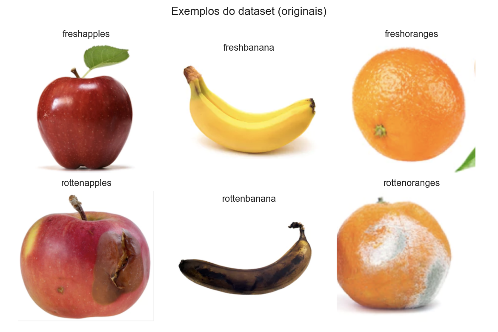

# 2. Pipeline proposto

```
Aquisição  ->  Pré-proc.   ->  Segmentação  ->  Extração de features      ->  Classificação    ->  Métricas
  (RGB)        blur/HSV        Otsu vs HSV       forma + Hu + cor + textura     KNN/LogReg/RF/SVM    acc/prec/rec/F1
  amostragem                   (escolhido HSV)   + indicadores de podridão      + GridSearchCV       ROC + matriz conf.
  balanceada                                     -> vetor X (52 dims)           + CV estratificada   + XAI (bônus)
```

Cada bloco corresponde a uma aula e nenhum é pulado. O código é modular
(`src/`) e os 4 notebooks reproduzem o pipeline ponta a ponta.

# 3. Segmentação ou isolamento do objeto (dois métodos)

Comparamos **dois métodos**, ambos seguidos do mesmo pós-processamento (abertura e
fechamento morfológicos, **preenchimento de buracos** e seleção do **maior
componente conectado**):

- **Método A — Otsu (tons de cinza).** Limiar global automático sobre a imagem em
  escala de cinza.
- **Método B — Cor em HSV.** O fundo (branco nas originais; preto nos cantos de
  imagens rotacionadas) tem **baixa saturação** com valor (V) muito alto **ou**
  muito baixo; a fruta é colorida. Definimos `objeto = não-fundo`.

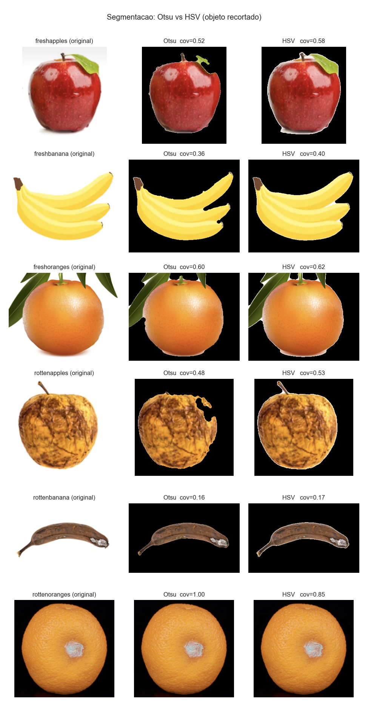

**Resultado.** O Otsu **falha** quando a fruta é clara e próxima do fundo — em
**laranjas frescas** chega a segmentar a imagem inteira (cobertura ≈ 1.0) ou quase
nada. O **HSV** é consistentemente mais robusto (lida com fundo branco e preto). Os
casos de cobertura ≈ 1.0 no HSV correspondem a **recortes justos** (a fruta preenche
o quadro), não a falhas. **Escolhemos o método HSV** para o pipeline principal.

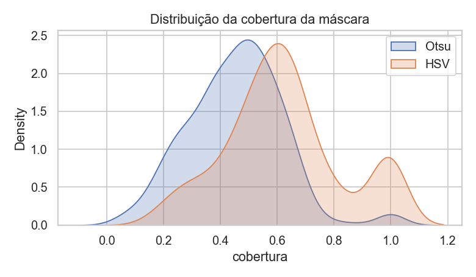

# 4. Features extraídas

Para cada fruta segmentada montamos um vetor **X de 52 dimensões**, com **uma
família de cada tipo** pedido (Aula 8). Estatísticas de cor/textura usam **apenas os
pixels da máscara**.

| Família | Features | Justificativa |
|---|---|---|
| **Forma** (8) | `area_frac`, `perimeter_norm`, `eccentricity`, `solidity`, `extent`, `circularity`, `aspect_ratio`, `equiv_diam_norm` | contorno do objeto; invariantes a escala |
| **Inercial** (7) | 7 momentos de **Hu** em escala log | descritores de forma invariantes |
| **Cor** (18) | média e desvio de R,G,B e H,S,V + histograma de matiz (6 bins) | a podridão escurece e desbota a casca |
| **Textura** (16) | **GLCM** (contrast, homogeneity, energy, correlation, dissimilarity, ASM) + histograma **LBP** (10 bins) | rugas e irregularidades da casca |
| **Podridão** (3) | `dark_ratio`, `brown_ratio`, `sat_std` | proporção de manchas escuras/marrons |

# 5. Seleção e análise de features

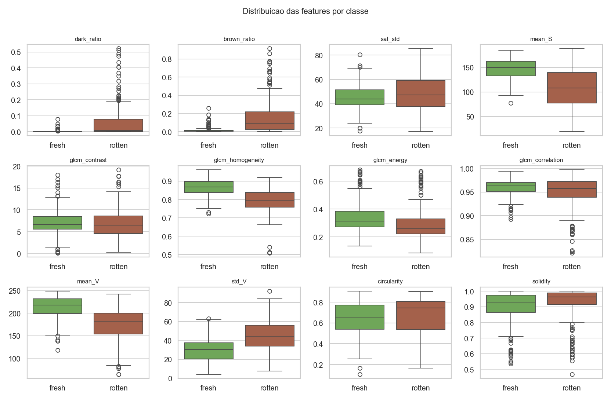

**Poder de separação (Cohen's *d*).** As features mais discriminativas são, em
módulo: `glcm_homogeneity` (−1.28), `mean_S` (−1.25), `lbp2` (+1.19), `mean_V`
(−1.15), `std_V` (+1.07), `brown_ratio` (+1.06). Ou seja, frutas podres têm **menor
saturação e brilho**, **textura menos homogênea** e **mais pixels marrons** — tudo
coerente com o problema.

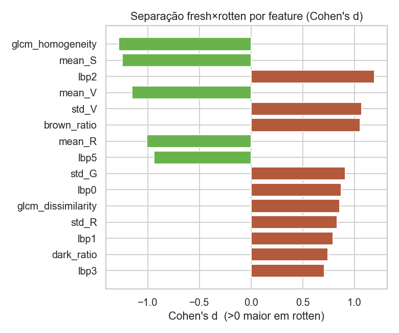

**Comparação entre grupos de features** (F1 por validação cruzada, Random Forest):

| Grupo | nº features | F1 (CV) |
|---|:-:|:-:|
| cor + textura | 34 | **0.928** |
| TODAS | 52 | 0.928 |
| cor + textura + forma | 42 | 0.920 |
| cor | 18 | 0.899 |
| textura | 16 | 0.859 |
| podridão | 3 | 0.798 |
| forma | 8 | 0.599 |
| Hu | 7 | 0.568 |

`cor + textura` **iguala** o conjunto completo; **forma** e **Hu** sozinhos são
fracos (frutas frescas e podres têm contornos parecidos). Mantemos uma família de
cada tipo conforme o enunciado, mas a evidência aponta cor+textura como essenciais.

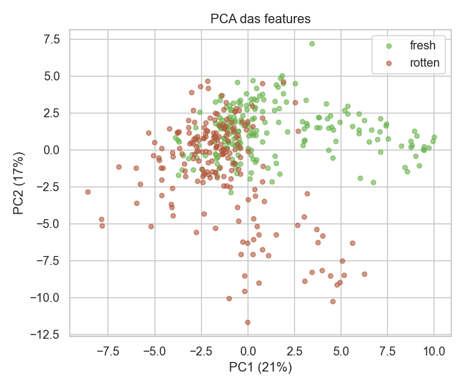

# 6. Classificadores

Treinamos **quatro classificadores clássicos** sobre o vetor X, cada um em um
`Pipeline(StandardScaler + modelo)` — o scaler é ajustado **só no treino de cada
fold** (sem vazamento). Hiperparâmetros por **`GridSearchCV`** (CV estratificada de
5 folds em treino+validação). Split **estratificado 60/20/20**
(treino=240, validação=81, teste=81).

| Modelo | Melhores hiperparâmetros | F1 (CV) |
|---|---|:-:|
| KNN | `n_neighbors=3, weights=distance` | 0.898 |
| Regressão Logística | `C=10` | 0.920 |
| Random Forest | `n_estimators=200, max_depth=8` | 0.908 |
| SVM | `C=10, kernel=rbf, gamma=scale` | 0.913 |

# 7. Resultados e métricas

**Avaliação final no conjunto de teste** (81 imagens, nunca usado no ajuste):

| Modelo | Acurácia | Precisão | Recall | F1 | ROC-AUC |
|---|:-:|:-:|:-:|:-:|:-:|
| **SVM (RBF)** | **0.975** | 0.975 | 0.975 | **0.975** | **0.994** |
| KNN | 0.951 | 0.950 | 0.950 | 0.950 | 0.980 |
| Random Forest | 0.938 | 0.927 | 0.950 | 0.938 | 0.983 |
| Regressão Logística | 0.914 | 0.902 | 0.925 | 0.914 | 0.959 |

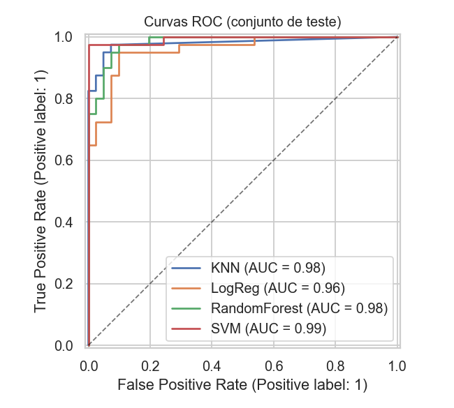


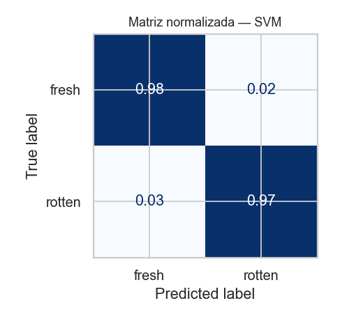

O **SVM** é o melhor modelo (F1 = 0.975, ROC-AUC = 0.994). Todos os modelos
superam F1 = 0.91, confirmando que features manuais simples de cor+textura capturam
bem a diferença `fresh × rotten`.

# 8. Análise de erros

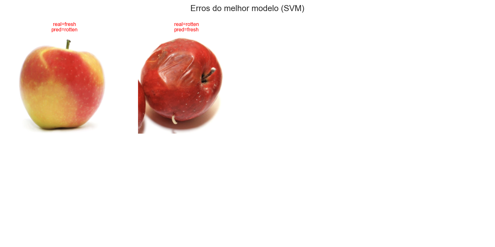

O melhor modelo erra em pouquíssimas imagens de teste. As hipóteses para os erros:

- **Frutas em transição** (levemente maduras): a casca já escureceu um pouco, mas
  ainda foi rotulada como `fresh` (ou vice-versa) — fronteira intrinsecamente
  ambígua.
- **Laranjas**: a casca naturalmente rugosa eleva as features de textura, podendo se
  confundir com a rugosidade da podridão.
- **Segmentação imperfeita** em recortes justos, em que parte do fundo/sombra entra
  na máscara e contamina as estatísticas de cor.

# 9. Conclusão

Para **produção**, recomendamos o **SVM (RBF)**: maior F1 e ROC-AUC, com bom
equilíbrio entre precisão e **recall de `rotten`** — crítico para **não deixar fruta
podre seguir para o varejo**. Se a interpretabilidade for prioridade (auditoria do
processo), a **Regressão Logística** é uma alternativa atraente: F1 = 0.914 com
coeficientes diretamente legíveis. O **Random Forest** oferece o melhor caminho para
**explicabilidade rica** (importâncias + SHAP) mantendo F1 alto.

O protótipo demonstra que **visão computacional clássica** já resolve o problema com
folga neste cenário de fundo controlado, a um custo computacional baixo (extração de
features < 16 s para 402 imagens) e com total interpretabilidade.

# 10. Bônus — Explicabilidade (XAI)

Aplicamos quatro métodos sobre a tabela X para responder *quais features mais
influenciaram a decisão*:

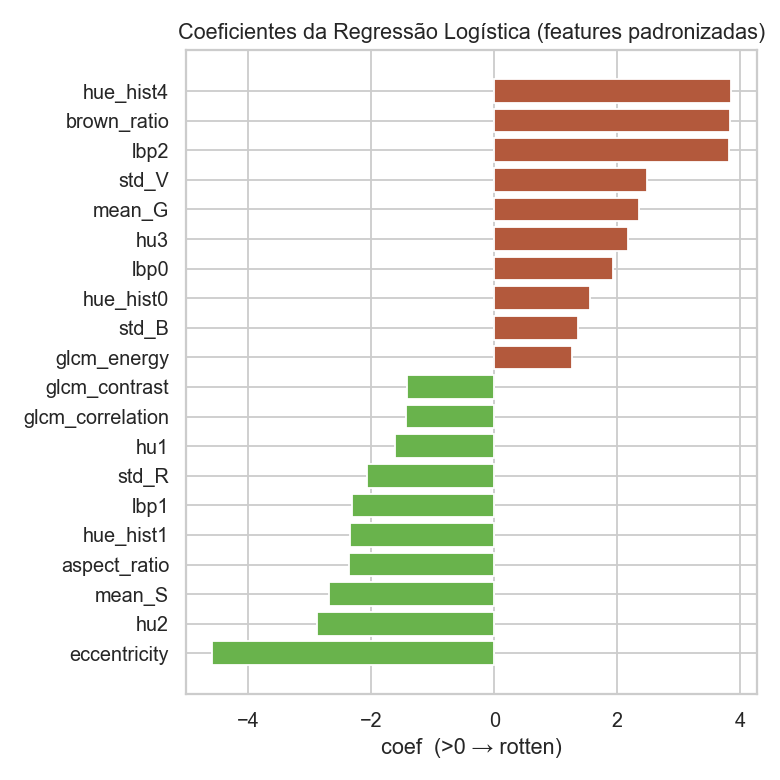
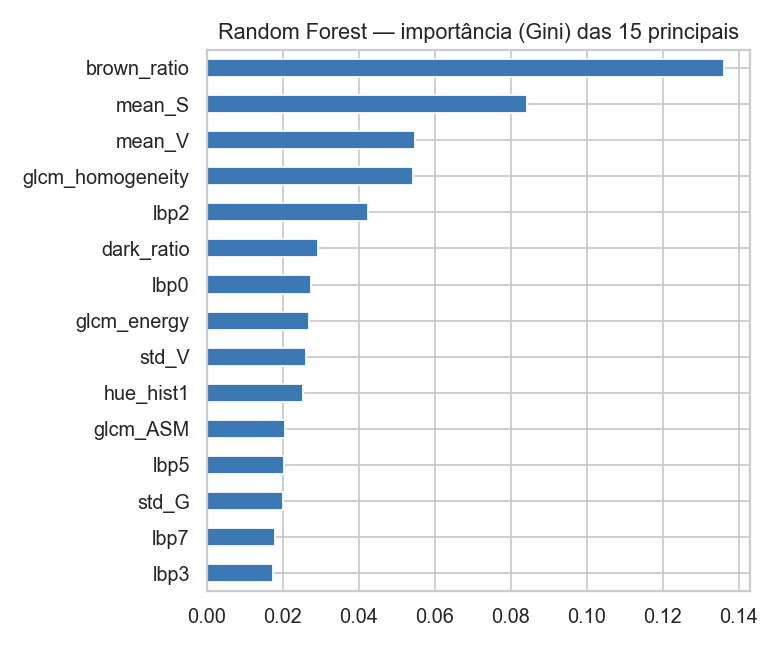
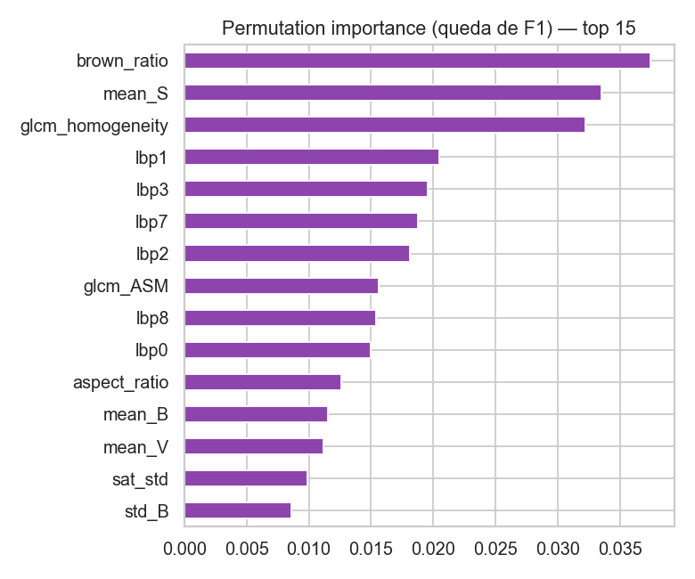
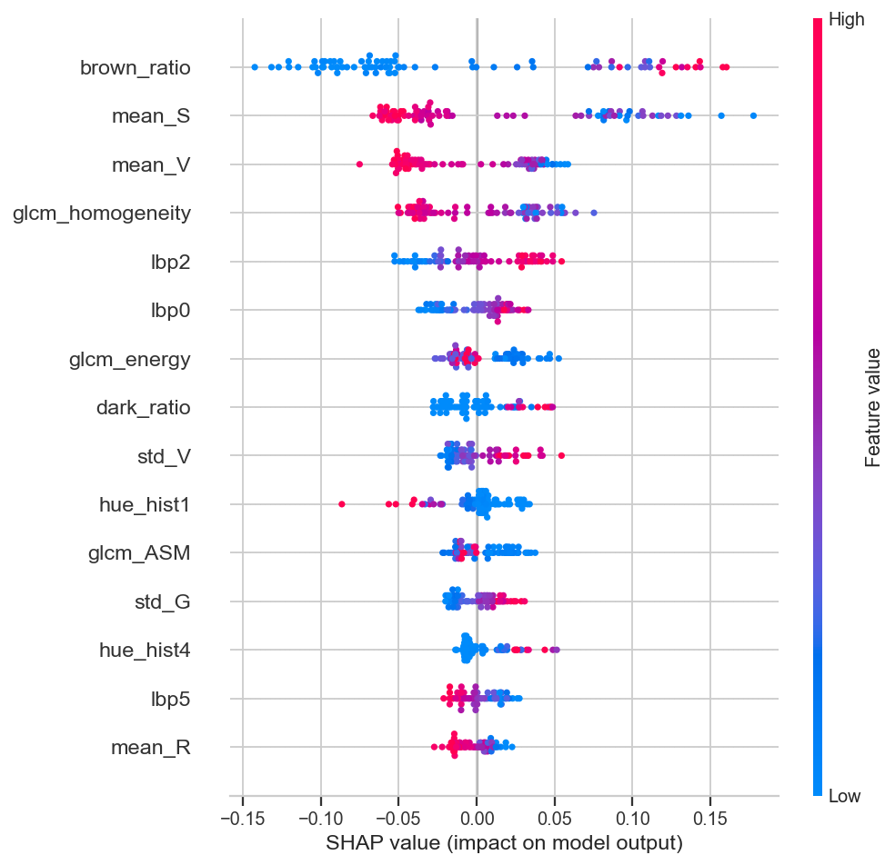

**Ablation study por grupos** (Δ F1 ao remover cada grupo, CV):

| Configuração | F1 (CV) | Δ vs. todas |
|---|:-:|:-:|
| sem **textura** | 0.899 | **−0.029** |
| sem **cor** | 0.907 | **−0.021** |
| sem Hu | 0.926 | −0.002 |
| TODAS | 0.928 | 0.000 |
| sem forma | 0.928 | +0.000 |
| sem podridão | 0.930 | +0.002 |

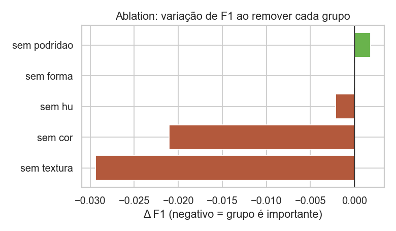

**Interpretação.** Os quatro métodos **concordam**: as features mais influentes são
de **cor/podridão** (`brown_ratio`, `mean_S`, `mean_V`, `dark_ratio`) e de
**textura** (`glcm_homogeneity`, `lbp`). O ablation confirma que remover **cor** e
**textura** derruba o F1, enquanto **forma**/**Hu** são irrelevantes. A decisão do
modelo é **coerente com o domínio** (podridão = escurecimento + manchas marrons +
textura irregular) e **não** depende do contorno nem do fundo — o que **reduz o
risco de viés**. *(A redundância das 3 features de podridão com o conjunto maior de
cor explica o Δ ≈ 0 ao removê-las isoladamente; sozinhas, ainda alcançam F1 = 0.80.)*

# 11. Limitações e melhorias

- **Fundo muito controlado**: em produção, variações de iluminação e esteira
  exigiriam recalibrar as features de cor (ex.: normalização de iluminância, balanço
  de branco) ou segmentação mais robusta.
- **Rótulo binário grosseiro**: a transição `fresh → rotten` é contínua; um esquema
  multi-classe (premium / sucos / descarte) seria mais útil comercialmente.
- **Segmentação**: comparar com GrabCut/U-Net como bônus poderia recuperar os poucos
  recortes imperfeitos.
- **Generalização**: validar com **imagens fora do dataset** (captura própria com
  smartphone) mediria robustez real.

---

*Reprodutibilidade:* `random_state = 42` em toda amostragem, split, CV e modelos;
`StandardScaler` ajustado apenas no treino. Código, `X.csv`, `y.csv` e todas as
figuras no repositório. Referência de XAI: Molnar, *Interpretable Machine Learning*.
